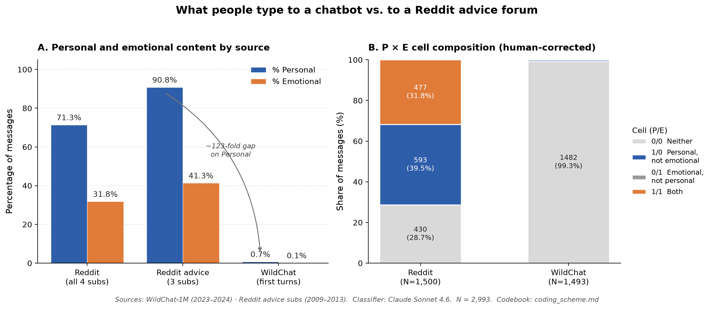

# AI Chatbot vs. Reddit: What People Type to Each

A small empirical study comparing first-turn user messages to a general-purpose AI chatbot (WildChat / ChatGPT, 2023–2024) against opening posts in Reddit advice-adjacent subreddits (2009–2013), on two independent dimensions: **Personal** and **Emotional**.




---

## TL;DR

> **Reddit advice forums:** ~91% of opening posts are personal, ~41% are emotional.
> **ChatGPT first turns:** 0.7% are personal, 0.1% are emotional.
> The gap on Personal is roughly **123-fold** — the direction people expect is reversed in this data.

Note what is and isn't being compared: Reddit posts drawn from subreddits chosen *because* people bring personal problems there, against a random cross-section of *all* ChatGPT traffic. That asymmetry is deliberate (the question is about venues, not populations), but it means 123-fold is an upper bound on any like-for-like gap. A random all-Reddit sample was never drawn, so unconditioned Reddit vs. unconditioned chatbot remains untested.

The dominant Reddit pattern, hidden by single-label "emotional/personal" coding, is **personal but measured**: ~40% of Reddit posts describe the author's own life in deliberative, non-affective language. Splitting the two dimensions made it visible.

## Headline

| Group | N | % Personal | % Emotional |
|---|---:|---:|---:|
| Reddit (all 4 subs) | 1,500 | **71.3%** | **31.8%** |
| Reddit advice (3 subs, excl. LifeProTips) | 1,125 | **90.8%** | **41.3%** |
| WildChat first turns | 1,493 | **0.7%** | **0.1%** |

Chi-square (Reddit advice vs WildChat): χ²(1) = 2,173 on Personal, χ²(1) = 744 on Emotional. Both p < 10⁻¹⁶⁰.

## Findings

1. **"Personal but not emotional" is the dominant Reddit pattern** — 593 of 1,500 posts (~40%). Most pronounced in r/personalfinance: ~90% Personal but only ~12% Emotional.
2. **The (0/1) "emotional but not personal" cell is empty** across both sources after manual correction. Expressing your own feelings makes the message about yourself.
3. **ChatGPT first turns are strikingly impersonal at scale.** 11 personal and 1 emotional out of 1,493. Users came for code help, summarization, math, role-play, factual questions — not personal disclosure.

Full discussion: [`research_article.md`](research_article.md).

## Personal vs. Emotional: An In-Depth Look

### Why two dimensions instead of one

Most disclosure research collapses "personal" and "emotional" into a single label. This study codes them as two independent binary dimensions, and that decision is what makes the main finding visible. A message can be:

| | Not Emotional | Emotional |
|---|---|---|
| **Not Personal** | Off-topic task (code help, trivia) | — (empty; see below) |
| **Personal** | Deliberative self-disclosure | Affective self-disclosure |

The two dimensions are not interchangeable. A post about whether to refinance a mortgage is personal (the author's own financial life) but not emotional (the language is analytical). A post that opens "I'm terrified I'm making the wrong call" is both. Treating them as one construct hides the first type entirely.

### The four-cell breakdown

| | Neither (0/0) | Personal only (1/0) | Emotional only (0/1) | Both (1/1) |
|---|---:|---:|---:|---:|
| Reddit (N = 1,500) | 430 | **593** | 0 | 477 |
| WildChat (N = 1,493) | 1,482 | 10 | 0 | 1 |

Reddit counts are the human-corrected ones (two manual flips from the spot check moved one post out of 0/1 and one from 1/0 to 1/1). The raw classifier output was 429 / 594 / 1 / 476 — that is what `analyze.py` prints, and `results.md` shows both rows side by side. Aggregate %P and %E are identical either way, because the two flips cancel.

Two things stand out immediately:

1. **The (0/1) cell — emotional but not personal — is empty across both sources.** After manual correction (the classifier over-read behavioral phrasing as named affect in one post), zero messages express emotion without also being about the author. Empirically, naming your own feelings makes the message about yourself. Note this is partly true by construction: the codebook's Rule 2 requires a *named internal state*, which is hard to satisfy without also being the subject.

2. **The dominant Reddit pattern is (1/0): personal but not emotional.** 593 posts — roughly 40% of all Reddit posts in the sample — describe the author's own life in measured, non-affective language. This is the single most common cell on the Reddit side, and it is nearly invisible if you use a single "emotional/personal" label.

### Variation across subreddits

The split comes into focus when you look at each subreddit individually:

| Subreddit | % Personal | % Emotional | % Personal-not-Emotional |
|---|---:|---:|---:|
| relationship_advice | 93.6% | 64.5% | ~29% |
| socialskills | 90.7% | 47.2% | ~43% |
| personalfinance | 88.0% | 12.3% | ~76% |
| LifeProTips | 13.1% | 3.2% | ~10% |

All three genuine advice subreddits have nearly identical Personal rates (~90%). What separates them is how much emotion surfaces in the language. r/personalfinance is the extreme case — nearly nine in ten posts are about the author's own financial life, but fewer than one in eight uses language that names an internal state. r/relationship_advice is at the opposite end: most posts are both personal *and* emotional. r/socialskills sits in the middle.

This variation is not explained by topic sensitivity. Finance, relationships, and social anxiety are all high-stakes domains. The difference is in how people frame their situation — analytically or affectively — and the data show both modes are common.

### The psychological implication

The "personal but not emotional" pattern challenges the assumption that online advice-seeking is primarily emotionally driven — that people post publicly because they need to vent and the advice is secondary. For a large fraction of Reddit posts, that picture is wrong.

Many users appear to be using advice forums as a **deliberative thinking tool**: articulating a situation precisely, structuring a decision, and soliciting outside judgment. The emotional stakes may be real, but they do not surface in the language. This is not a niche pattern — it is the modal one.

The distinction matters practically. A post laying out mortgage amortization scenarios calls for a different kind of response than a post that opens with "I don't know how much more of this I can take." Both are personal. Only one is emotional. Collapsing them produces a blurrier picture of what advice-seekers actually need.

### What the AI side shows — and the caveat

Across 1,493 random 2023–2024 ChatGPT first turns, only 10 were personal-but-not-emotional and 1 was both-personal-and-emotional. The deliberative advice-seeking mode that is dominant on Reddit was almost entirely absent from the AI side in that window. Users came to ChatGPT for tasks — code, math, summarization, creative writing — not to think through their own situations out loud.

**The caveat:** that baseline is already dated. Between 2024 and 2026, how people use general-purpose chatbots has shifted. More users now visibly bring "help me think through this decision," "here is my situation — what am I missing?", and career or relationship dilemmas to ChatGPT and Claude. Whether the personal-but-measured cell on the AI side has grown substantially, and whether the gap to Reddit has narrowed, is the most direct empirical follow-up this study opens. The methodology is designed to re-run on a fresh AI-side sample with no codebook changes.

Full discussion in [`research_article.md`](research_article.md) §6.3.

## Method

Two independent binary codes per message:

- **P = 1** if the author is the subject *and* the topic is in a life domain (relationships, body/health, finances, feelings, decisions, identity, work/career).
- **E = 1** if the message contains an explicit emotion word naming the author's own state, or clear affective phrasing that names an internal state. Neutral or deliberative language is E = 0 even when the topic is heavy.

Four disambiguating rules (framing > topic; self-involvement isn't enough; strict threshold for affect; content ≠ affect). Codebook in [`coding_scheme.md`](coding_scheme.md).

Classifier: Claude Sonnet 4.6 via the Anthropic Message Batches API, with the codebook as a cached system prompt and a JSON-schema-constrained output.

**On validation, stated precisely** — this matters more than a badge:

- **Pilot: 40/40 agreement on 40 hand-labeled posts**, reproducible by running `classify.py` against the committed `pilot_coding.csv`. Read it as *in-sample*: Rule 2 was tightened specifically to resolve a disagreement on one of those 40 posts (`rd_a20ea`, see the `coding_scheme.md` change log), and agreement was then measured on the same 40. Half the set is WildChat task text that is unambiguously 0/0, so it is an easier test than the number suggests.
- **Spot check: a 24-row stratified review of full-run predictions found 22/24 agreement**, and produced the two manual corrections applied above. **The per-row labels for that review were never captured in this repo** — `spot_check_sample.csv` is the 52-row sample the committed sampler generates, with the `human_p` / `human_e` columns blank. So the 22/24 figure is documented in `results.md` but not independently checkable from committed files. It is reported here as a note, not as evidence.
- **All labeling was done by one person (the author). There is no second coder and no inter-rater reliability statistic anywhere in this project.**

## Repo layout

```
.
├── README.md                  # this file
├── research_article.md        # standalone writeup
├── results.md                 # detailed results with tables and chi-square
├── pilot_results.md           # N=40 pilot results (2026-04-23)
├── coding_scheme.md           # the locked codebook (4 rules, worked examples)
├── data_notes.md              # data sources, sampling, schema, caveats
├── audit_findings.md          # internal audit notes
│
├── classify.py                # single-message classifier (validates against pilot)
├── classify_batch.py          # batch driver for full-run classification
├── analyze.py                 # produces headline table, P×E matrix, chi-square
├── spot_check.py              # generates the stratified QA sample
├── make_figure.py             # produces figures/headline.png from predictions.csv
│
├── figures/
│   └── headline.png           # two-panel headline figure (embedded above)
│
├── pilot_coding.csv           # 40 hand-labeled pilot rows
├── predictions.csv            # 2,993 full-run predictions
├── validation_results.csv     # 40-row pilot validation output
└── spot_check_sample.csv      # stratified QA sample (52 rows, human columns blank)
│
├── requirements.txt           # pinned dependencies + tested Python version
├── CITATION.cff               # citation metadata
└── .github/workflows/ci.yml   # compiles the scripts and re-runs analyze.py
```

`batch_state.json` (the batch ID and row metadata used for resumable polling) is written at submit time and is **not** committed — it is machine-specific and expires. See `.gitignore`.

## Reproducing

The two raw upstream samples (`reddit_sample.csv`, `wildchat_sample.csv`) are **not committed** to this repo for redistribution-licensing reasons. Recreate them from Hugging Face before running the batch — sampling parameters and seeds are documented in [`data_notes.md`](data_notes.md):

- `allenai/WildChat-1M` — English filter, 10–1000 words, random sample of 1,500 from 15,000 candidates, `seed=42`.
- `HuggingFaceGECLM/REDDIT_submissions` — subreddits `relationship_advice`, `socialskills`, `personalfinance`, `LifeProTips`; non-deleted, non-empty, 10–1000 words; 375 per subreddit, `seed=42`.

Output schemas are in [`data_notes.md`](data_notes.md) §Data dictionary.

The pipeline:

**The fastest path:** every number in this README comes from the committed `predictions.csv`, so you can verify the whole analysis with no API key and no raw data:

```bash
pip install -r requirements.txt
python3 analyze.py      # reproduces the headline table, P×E matrix, and all four χ²
python3 make_figure.py  # regenerates figures/headline.png
```

The full pipeline, from scratch:

```bash
# 1. Install dependencies (pinned versions; Python 3.10+)
pip install -r requirements.txt

# 2. Set API key
export ANTHROPIC_API_KEY=sk-ant-...

# 3. Recreate reddit_sample.csv and wildchat_sample.csv
#    NOTE: no loader script is committed for this step — you must write one
#    against the parameters in data_notes.md. Upstream dataset revision hashes
#    were not pinned, so an exact byte-identical rebuild is not guaranteed.

# 4. Validate the classifier against the 40-row pilot (~$0.05)
python3 classify.py
# → writes validation_results.csv; expect 40/40 agreement
#   (runs off the committed pilot_coding.csv — step 3 is not required for this)

# 5. Run the full batch (~$1–3, completes in under an hour)
python3 classify_batch.py
# → writes predictions.csv and, on failure, errors.csv
# → writes batch_state.json; to resume that batch after an interruption:
python3 classify_batch.py --resume

# 6. Produce the headline table and chi-square
python3 analyze.py

# 7. Regenerate the headline figure
python3 make_figure.py

# 8. (Optional) generate a stratified QA sample — needs step 3, for message text
python3 spot_check.py
# → writes spot_check_sample.csv for manual review
```

Seeds: the QA sampler in `spot_check.py` uses `random.seed(42)` and reproduces the committed sample exactly. The seeds quoted for the upstream data draw (42) and the pilot draw (7) describe scripts that were **not** committed — only their outputs (`pilot_coding.csv`, and the gitignored sample CSVs) are.

## Data

| Source | Dataset | N | Range |
|---|---|---:|---|
| AI side | [`allenai/WildChat-1M`](https://huggingface.co/datasets/allenai/WildChat-1M) — first user turn | 1,500 | 2023–2024 |
| Human side | [`HuggingFaceGECLM/REDDIT_submissions`](https://huggingface.co/datasets/HuggingFaceGECLM/REDDIT_submissions) — opening post | 1,500 | 2009–2013 |
| Subreddits | r/relationship_advice, r/socialskills, r/personalfinance, r/LifeProTips | 375 each | — |

Filters: English, 10–1000 words, non-deleted, non-empty.

Three duplicate WildChat IDs and four classifier refusals are dropped at analysis time, leaving **N = 2,993**.

## Caveats

- **Temporal mismatch.** Reddit is 2009–2013; WildChat is 2023–2024. Era could explain some of the gap, but not a ~123-fold one.
- **The two sides are not conditioned the same way.** The Reddit arm is drawn from subreddits selected for personal disclosure; the WildChat arm is unconditioned general traffic. The gap is real at every level of the range (even LifeProTips, the least personal sub at 13.1%, is ~18× WildChat), but the headline multiplier is an upper bound, not a like-for-like estimate. A symmetric design would classify WildChat turns for advice-seeking intent first, or draw a random all-Reddit sample. Neither was done.
- **The Personal ratio rests on 11 events.** Only 11 of 1,493 WildChat messages were coded Personal. The point estimate (~123×) has a wide confidence interval (roughly 68× to 222×); "two orders of magnitude" is the defensible claim, not any precise multiple.
- **Validation is single-rater and partly in-sample.** One person wrote the codebook and produced every human label. No second coder, no Cohen's κ. The 40/40 pilot figure was measured after tightening a rule to resolve a disagreement within that same 40-post set, and the 22/24 spot-check labels are not committed. See Method above.
- **The AI side is itself dated.** WildChat closed in 2024. Between then and 2026, chatbot use has shifted — more users now bring relationship questions, career decisions, mental-health check-ins, and "help me understand myself" prompts to general-purpose AI. The 0.7% / 0.1% headline should be read as a **2023–2024 baseline**, not a current estimate. A re-run on 2025–2026 logs would very likely show a higher Personal rate on the AI side and a narrower gap. The methodology here is designed to drop straight onto a fresh sample with no codebook changes.
- **Subreddit choice.** Four advice-adjacent subs, not all of Reddit. r/AskReddit and r/Advice were not in the upstream dataset.
- **General-purpose chatbot only.** This is not a sample of "people seeking emotional support from AI" — companionship-marketed products (Replika, Character.AI) would likely look very different.
- **First-turn only.** A neutral first turn can precede intensely personal later turns. Conversational drift is out of scope.
- **Self-selected populations.** Findings describe these subgroups, not "people in general."
- **Observable text, not inner state.** A person could feel lonely and ask for a cover letter. The finding is about what users typed, not what they felt.

## Citation

If you reference this work:

```
Bravo, R. (2026). Personal but Not Emotional: What Reddit Advice Posts and
ChatGPT First Turns Reveal About How People Address Human and AI Listeners.
```

## License

MIT (code). Source datasets retain their upstream licenses — see WildChat-1M and HuggingFaceGECLM/REDDIT_submissions on Hugging Face.
